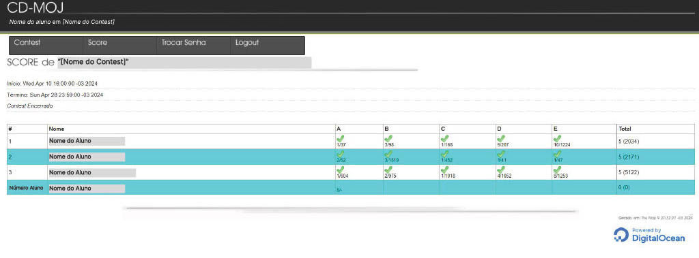

# <a> Guia de Estilo </a>

## <a> Introdução </a>
Segundo Barbosa et al (2021)<a id="anchor_1" href="#REF1">^1^</a>, o guia de estilo é um documento que registra as decisões de design importantes em projetos, garantindo consistência. Ele fornece diretrizes para elementos como layout, tipografia, cores e interação. O guia é uma ferramenta de comunicação entre equipes de design e desenvolvimento, e pode ser usado em diferentes níveis, como plataforma ou produto. É essencial para manter a coerência no design, mas não é um conjunto rígido de regras, mas sim um apoio flexível ao processo criativo.

## <a> Metodologia </a>

A metodologia utilizada para desenvolver este guia de estilo envolveu a revisão de literatura sobre design e interação humano-computador, seguida pela análise do ambiente e contexto de uso dos usuários. Criamos um protótipo inicial, revisado por membros da equipe e stakeholders, coletando feedback para orientar melhorias. Implementamos as diretrizes no ambiente de desenvolvimento e realizamos testes de usabilidade. A manutenção do guia é contínua, com atualizações baseadas em novas descobertas e feedbacks, assegurando a colaboração entre designers, desenvolvedores e outras partes interessadas.

## <a> Objetivo </a>
O objetivo deste guia de estilo é orientar o desenvolvimento do projeto de IHC, especialmente no que diz respeito à identidade visual do CD-MOJ. Aqui serão registradas as principais decisões de design tomadas, de forma que elas fiquem organizadas e possam ser facilmente consultadas e utilizadas nas discussões ou versões futuras do projeto.

### <a> Organização e conteúdo </a>
O guia de estilo será organizado com tópicos contendo os seguintes conteúdos<a id="anchor_2" href="#REF2">^2^</a>:

- Resultados de análise: Descrição do ambiente de trabalho do usuário;
- Elementos de interface: Disposição espacial, janelas, tipografia e cores;
- Elementos de interação: Estilos de interação, seleção de um estilo e aceleradores;
- Elementos de ação: Preenchimento de campos, seleção e ativação;
- Vocabulários e padrões: Terminologia, tipos de tela, sequências de diálogos.

### <a> Público-alvo </a>
Os públicos-alvo deste guia de estilo são:
 
- Estudantes de IHC que poderão utilizar este documento como material de estudo e referência;
- Integrantes do grupo que utilizarão como ferramenta de organização no desenvolvimento do projeto de IHC;
- Desenvolvedor(es) responsável(eis) pela interface do CD-MOJ.

### <a> Como utilizá-lo </a>
Este documento deve ser utilizado como ferramenta de apoio e criatividade no processo de design durante todo o ciclo de vida do projeto, auxiliando na tomada de decisões sobre quais elementos de interface, interação e ação melhorar, remover ou implementar no projeto. 

O guia de estilo deve ser comunicado e ser de fácil acesso às partes interessadas (integrantes do grupo, designers etc), essa comunicação irá garantir que a interface final atenda às necessidades dos usuários, promovendo uma interação eficaz e satisfatória.

### <a> Como mantê-lo </a>
O guia de estilo é um documento dinâmico que precisa de manutenção recorrente (pelo menos até o final do projeto), para manter-se atualizado e garantir sua utilidade ao longo das versões, bem como as novas ideias obtidas durante o desenvolvimento e interação entre as partes interessadas. Para garantir a manutenção adequada do guia de estilo, seguir as seguintes práticas é essencial<a id="anchor_3" href="#REF1">^3^</a>:

- Atualizações regulares: Sempre que ocorrerem decisões de design ou desenvolvimento que afetem o site, o guia de estilo deverá ser atualizado para refletir essas mudanças. Isso inclui adicionar ou atualizar elementos de interface e ajustar as recomendações com base em feedbacks e aprendizados obtidos durante o processo de desenvolvimento;

- Colaboração contínua: Manter o guia de estilo é uma tarefa colaborativa. Encorajar a participação ativa da equipe de desenvolvimento, designers e outros stakeholders para fornecer feedback, sugestões e contribuições para o aprimoramento do guia;

- Versionamento e controle de alterações: É recomendado utilizar um sistema de controle de versão para o guia de estilo para ter um registro claro das modificações, permitindo rastrear e revisar as alterações feitas ao longo do tempo. Isso facilita a colaboração, a revisão de alterações anteriores e a identificação de possíveis regressões;

- Avaliação e feedback dos usuários: Devemos buscar constantemente o feedback dos usuários sobre a usabilidade da interface. As percepções e necessidades dos usuários podem mudar ao longo do tempo, portanto, é importante estar aberto a sugestões e críticas construtivas para aprimorar o guia de estilo e a experiência do usuário.

## <a>Resultados de Análise </a>

O CD-MOJ é uma plataforma dedicada principalmente a usuários que a acessam através de computadores desktop e notebooks. É crucial, portanto, que o design da interface seja especialmente ajustado para essas configurações de hardware, assegurando uma experiência de usuário fluida e eficaz. Isso inclui adaptações da interface para diferentes resoluções e tamanhos de tela, a seleção de elementos visuais apropriados e a incorporação de funcionalidades que sejam tanto intuitivas quanto de fácil acesso. Detalhes adicionais sobre os elementos da interface podem ser encontrados na figura 1.

## <a>Elementos de interface </a>
Os elementos sobre disposição espacial e grid, janelas, tipografia, logos, cores e janelas são apresentados nas imagens a seguir.

??? - "Logos"

    <figure markdown>
Imagem 1 - Logos.

    <figure markdown>
    
Fonte: [Douglas Marinho](https://github.com/M4RINH0).

??? - "Cores"

    <figure markdown>
Imagem 2 - Cores.

    <figure markdown>
    
Fonte: [Douglas Marinho](https://github.com/M4RINH0).

??? - "Tipografia"

    <figure markdown>
Imagem 3 - Tipografia.

    <figure markdown>
    
Fonte: [Douglas Marinho](https://github.com/M4RINH0).

??? - "Janela Inicial"

    <figure markdown>
Imagem 4 - Janela Inicial.

    <figure markdown>
    
Fonte: [Douglas Marinho](https://github.com/M4RINH0).

??? - "Janela de Login"

    <figure markdown>
Imagem 5 - Janela de Login.

    <figure markdown>
    
Fonte: [Douglas Marinho](https://github.com/M4RINH0).

??? - "Janela de Submissão"

    <figure markdown>
Imagem 6 - Janela de Submissão.

    <figure markdown>
    
Fonte: [Douglas Marinho](https://github.com/M4RINH0).

??? - "Janela de Score"

    <figure markdown>
Imagem 7 - Janela de Score.

    <figure markdown>
    
Fonte: [Douglas Marinho](https://github.com/M4RINH0).

??? - "Janela de Criação de Contest por Formulário"

    <figure markdown>
Imagem 8 - Janela de Criação de Contest por Formulário.

    <figure markdown>
    
Fonte: [Douglas Marinho](https://github.com/M4RINH0).

??? - "Janela de Criação de Contest por Arquivo"

    <figure markdown>
Imagem 9 - Janela de Criação de Contest por Arquivo.

    <figure markdown>
    
Fonte: [Douglas Marinho](https://github.com/M4RINH0).

## <a>Elementos de Interação </a>

### <a> Estilo de Interação </a>
Os usuários podem interagir com o site na seleção de contests, login, submissão de problemas, confirmação de resultado e score. Os quais são feitos através de botões e/ou _hiperlinks_.

### <a> Seleção de Estilos </a>
A escolha do estilo do CD-MOJ tem a interface simples e minimalista, focada nos objetivos de encontrar um contest e submeter seus codigos de resposta, tanto que suas páginas não destoam muito umas das outras, com botões semelhantes.

### <a> Aceleradores (Teclas de Atalho) </a>
No site não foram encontradas teclas de atalho.

## <a>Elementos de Ação </a>

### <a> Preenchimento de Campos </a>
Os campos de preenchimento disponíveis na interface do sistema exigem que o usuário insira informações manualmente, de acordo com suas necessidades e objetivos. Esses campos podem incluir a caixa de texto para login e senha, que são exemplos de campos que exigem entrada de texto e também caixa de seleção de arquivos locais para envio de codigos para submissão.

### <a> Seleção </a>
Há alguns elementos de seleção como por exemplo seleção de problema para envio de arquivo, seleção do contest.

### <a> Ativação </a>
Incluem botões, links e outros elementos clicáveis. No site encontramos elementos como botões de redirecionamento de orgãos que auxiliam e hosteam e _hyperlinks_.

## <a>Vocabulários e padrões </a>

### <a> Tipos de Tela </a>
As telas seguem um padrão simples e minimalista, elas não destoam muito uma das outras, seguindo a mesma identidade visual.

### <a> Sequência de Diálogos </a>
As sequências seguem um padrão, os botões de confirmação e cancelamento são semelhantes em páginas diferentes.

## <a>Propostas de Intervenção </a>
As propostas de intervenção foram desenvolvidas com base nas [Metas de Usabilidade](https://interacao-humano-computador.github.io/2024.1-CD-MOJ/analise-de-requisitos/metasDeUsabilidade/) e nos [Princípios Gerais](https://interacao-humano-computador.github.io/2024.1-CD-MOJ/analise-de-requisitos/principios/) definidos para o projeto da Bilheteria Digital. Essas diretrizes foram utilizadas como referência para identificar áreas de melhoria e sugerir mudanças que visam aprimorar a usabilidade e a experiência do usuário.

### <a>Metas de Usabilidade</a>
Com base nas [Metas de Usabilidade](https://interacao-humano-computador.github.io/2024.1-CD-MOJ/analise-de-requisitos/metasDeUsabilidade/) foram levantados pontos específicos que podem ser aprimorados no sistema. Para a meta de utilidade, foi proposto melhoras em eficácia, eficiência, segurança, utilidade e aprendizagem.

### <a>Princípios Gerais</a>
Em relação aos princípios, que envolvem consistência, feedback, prevenção de erros, flexibilidade e simplicidade, foram consideradas mudanças que promovam a simplicidade nas estruturas de tarefas e correspondência com as expectativas do usuário. Por exemplo uma violação do princípio de Correspondência com a Expectativa do Usuário pois no canto superior da tela, o texto "acmICPC" parece ser clicável e gera a expectativa de direcionar para um link útil. No entanto, ao clicar, o usuário é redirecionado para uma página que exibe o erro 403 que pode ser visto em [Princípios Gerais](https://interacao-humano-computador.github.io/2024.1-CD-MOJ/analise-de-requisitos/principios/).

Outros aspecto importante são o equilíbrio entre o controle e liberdade do usuário. Pode-se observar no site a limitação da capacidade dos usuários de alterarem seus logins e senhas, sendo possível apenas através de intervenção do professor. Onde causa dificuldade para os usuários decorarem diversas senhas e logins em geral um para cada contest.

## <a> Referência Bibliográfica </a>
> <a id="REF1" href="#anchor_1">1.</a> BARBOSA, Simone Diniz Junqueira et al. Interação humano-computador e experiência do usuário. 1. ed. Rio de Janeiro: Simone Diniz Junqueira Barbosa, 2021.

> <a id="REF2" href="#anchor_2">2.</a> Plano de Ensino da disciplina Interação Humano Computador, Dr. André Barros de Sales. [Plano de Ensino](https://aprender3.unb.br/pluginfile.php/2843624/mod_resource/content/48/Plano_de_Ensino%20FIHC%20012024%20Turma%201.pdf)

> <a id="REF3" href="#anchor_3">3.</a> ALVISSUS, Giovanni; GOMES, Larissa. Guia de Estilo. Repositório da disciplina de Interação Humano Computador da Universidade de Brasília, 2023. Disponível em: <<https://github.com/Interacao-Humano-Computador/2023.1-BancoCentral/blob/master/docs/analise_requisitos/guia_estilo.md>>.

## <a> Bibliografia </a>
> QUEIROZ, João. Princípios e Diretrizes para o Design de IHC: Guias de Estilo. Docentes do IFRN, online. 2014. Disponível em: <<https://docente.ifrn.edu.br/joaoqueiroz/disciplinas/ihc-interacao-humano-computador/aulas/aula-8>>. Acesso em: 11/05/2024.

> BRAGA, Caio; FILHO, Doan. Guia de Estilo. Repositório da disciplina de Interação Humano Computador da Universidade de Brasília, 2023. Disponível em: <<https://github.com/Interacao-Humano-Computador/2023.2-PlataformaLattes/blob/main/docs/analise_requisitos_2/guia_estilo.md>>. Acesso em: 11/05/2024. 

## <a> Histórico de Versão </a>

| Versão| Data | Data Prevista de Revisão| Descrição  | Autor(es)  | Revisor(es) |
| ------- | ------ | ------ | ------- | -------- | -------- |
| `1.0` | 10/05/2024 | 11/05/2024 | Criação da introdução do guia de estilo | [Luiz Gustavo](https://github.com/LuizGust4vo) | [Douglas Marinho](https://github.com/M4RINH0) |
| `1.1` | 13/05/2024 | 13/05/2024 | Adição dos resultados da analise | [Douglas Marinho](https://github.com/M4RINH0) | [Diego Sousa](https://github.com/DiegoSousaLeite) |
| `1.2` | 13/05/2024 | 13/05/2024 | Adicionar hyperlink em titulos | [Douglas Marinho](https://github.com/M4RINH0) | [Diego Sousa](https://github.com/DiegoSousaLeite) |
| `1.3` | 15/05/2024 | 18/05/2024 | Adição das referências bibliográficas | [Luiz Gustavo](https://github.com/LuizGust4vo) | [Arthur Alves](https://github.com/Arthrok), [Douglas Marinho](https://github.com/M4RINH0) e [Eric Silveira](https://github.com/ericbky) |
| `2.0` | 07/07/2024 | 08/07/2024 | Padronização de titulos, adição da metodologia e troca de link do figma por imagens | [Douglas Marinho](https://github.com/M4RINH0) | [Eric Silveira](https://github.com/ericbky) e [Diego Sousa](https://github.com/DiegoSousaLeite)|
