## <a>Introdução</a>

Este documento apresenta os resultados das entrevistas conduzidas pelo Grupo 01 para avaliar o protótipo de alta fidelidade do CD-MOJ, uma plataforma de juiz online destinada à correção automatizada de problemas de programação. A avaliação foi realizada seguindo as diretrizes do plano de avaliação, com o objetivo de identificar pontos fortes e áreas de melhoria no design e na experiência do usuário.

## <a>Objetivo</a>

O objetivo deste artefato é documentar e analisar os resultados das entrevistas de avaliação do protótipo de alta fidelidade do CD-MOJ. Especificamente, busca-se:

1. Identificar percepções dos usuários sobre a usabilidade e funcionalidade do protótipo.
2. Avaliar a satisfação dos usuários com a interface e experiência oferecida pelo CD-MOJ.
3. Destacar pontos de melhoria sugeridos pelos usuários.
4. Fornecer recomendações práticas para o aprimoramento do CD-MOJ.

## <a>Metodologia</a>

A metodologia seguiu o framework DECIDE:

- **Determinar Metas:** Avaliar a usabilidade e a experiência do usuário com o protótipo.
- **Explorar Questões:** Investigar aspectos específicos da interação do usuário.
- **Escolher Paradigmas:** Utilizar entrevistas semiestruturadas e observação direta.
- **Identificar Questões Práticas:** Seleção de participantes, preparação das entrevistas.
- **Decidir Questões Éticas:** Garantir a privacidade e o consentimento dos participantes.
- **Avaliar e Interpretar Dados:** Analisar respostas qualitativas e quantitativas.

Na execução da avaliação, recrutamos perfis de acordo com o <a href="https://interacao-humano-computador.github.io/2024.1-CD-MOJ/analise-de-requisitos/perfildeUsuario/">Perfil de Usuário</a>, assim cada um dos seis integrantes do nosso grupo desenvolveu uma tarefa para o protótipo de alta fidelidade, resultando em um total de seis tarefas a serem avaliadas. Para garantir uma análise abrangente e detalhada, optamos por recrutar de 3 a 4 pessoas para o processo de entrevista de cada tarefa, pois segundo Krug<a id="anchor_1" href="#FRM1">^1^</a>, é possível identificar a maioria dos problemas, tornando possível a elaboração da análise no mesmo dia. Cada entrevistado será responsável por analisar uma tarefa. Essa divisão foi estrategicamente planejada para maximizar a cobertura de feedback sobre as diferentes tarefas no protótipo, enquanto se mantém uma carga gerenciável para cada participante.

<b>Tabela 1</b> - Execução das entrevistas

| Entrevistador | Entrevistado | Tarefa Analisada | Horário de Início | Horário de Fim | Data       | Local |
|-------------------|-----------------|----------------------|-------------------|----------------|------------|-------|
| Arthur Alves      | Gustavo       | <a href="/2024.1-CD-MOJ/design-avaliacao-desenvolvimento/nivel1/storyboard/storyboards/#tarefa-2-tutorial-de-resolucao-de-questoes-pos-contest">Tutorial de Resolução de Questões Pós-Contest</a>            | 14:10         | 14:20      | 03/07  | Itrac LDTEA   |
| Arthur Alves      | Luan       | <a href="/2024.1-CD-MOJ/design-avaliacao-desenvolvimento/nivel1/storyboard/storyboards/#tarefa-2-tutorial-de-resolucao-de-questoes-pos-contest">Tutorial de Resolução de Questões Pós-Contest</a>            | 14:45         | 15:00      | 03/07  |  Itrac LDTEA  |
| Arthur Alves      | Joyce       | <a href="/2024.1-CD-MOJ/design-avaliacao-desenvolvimento/nivel1/storyboard/storyboards/#tarefa-2-tutorial-de-resolucao-de-questoes-pos-contest">Tutorial de Resolução de Questões Pós-Contest</a>            | 17:40        | 17:45     | 03/07 | Lappis Contâiner - FGA  |
| Diego Sousa  e João Artur    | Paulo Henrique| <a href="https://interacao-humano-computador.github.io/2024.1-CD-MOJ/design-avaliacao-desenvolvimento/nivel1/storyboard/storyboards/#tarefa-4-ranking-de-contest">Ranking de Contest</a> e <a href="https://interacao-humano-computador.github.io/2024.1-CD-MOJ/design-avaliacao-desenvolvimento/nivel1/storyboard/storyboards/#tarefa-3-verificacao-de-submissoes">Verificar Submissão</a>            | 19:30         | 19:40      | 03/07  | Teams |
| Diego Sousa  e João Artur    | José Eduardo     | <a href="https://interacao-humano-computador.github.io/2024.1-CD-MOJ/design-avaliacao-desenvolvimento/nivel1/storyboard/storyboards/#tarefa-4-ranking-de-contest">Ranking de Contest</a> e <a href="https://interacao-humano-computador.github.io/2024.1-CD-MOJ/design-avaliacao-desenvolvimento/nivel1/storyboard/storyboards/#tarefa-3-verificacao-de-submissoes">Verificar Submissão</a>          | 19:40         | 19:50      | 03/07 | Teams   |
| Diego Sousa  e João Artur    | Pedro       | <a href="https://interacao-humano-computador.github.io/2024.1-CD-MOJ/design-avaliacao-desenvolvimento/nivel1/storyboard/storyboards/#tarefa-4-ranking-de-contest">Ranking de Contest</a> e <a href="https://interacao-humano-computador.github.io/2024.1-CD-MOJ/design-avaliacao-desenvolvimento/nivel1/storyboard/storyboards/#tarefa-3-verificacao-de-submissoes">Verificar Submissão</a>                        | 17:20         | 17:30      | 03/07  | Teams   |
| Douglas Marinho      |Ana Júlia       | <a href="/2024.1-CD-MOJ/design-avaliacao-desenvolvimento/nivel1/storyboard/storyboards/#tarefa-5-criacao-de-problema-administrador">Criar Contest</a>            | 19:00         | 19:10      | 03/07  | Casa do entrevistador   |
| Douglas Marinho      |Júlia Fortunato      | <a href="/2024.1-CD-MOJ/design-avaliacao-desenvolvimento/nivel1/storyboard/storyboards/#tarefa-5-criacao-de-problema-administrador">Criar Contest</a>            | 17:50         | 18:00      | 03/07  | Microsoft Teams   |
| Douglas Marinho      |Felipe Motta       | <a href="/2024.1-CD-MOJ/design-avaliacao-desenvolvimento/nivel1/storyboard/storyboards/#tarefa-5-criacao-de-problema-administrador">Criar Contest</a>            | 22:00         | 22:10      | 03/07  | Microsoft Teams   |
| Eric Silveira     | Luan     |<a href="/2024.1-CD-MOJ/design-avaliacao-desenvolvimento/nivel1/storyboard/storyboards/#tarefa-1-submissao-de-problemas">Submissão de Problemas</a>            | 14:30         | 14:45      | 03/07  | Itrac LDTEA   |
| Eric Silveira     | Gustavo    |<a href="/2024.1-CD-MOJ/design-avaliacao-desenvolvimento/nivel1/storyboard/storyboards/#tarefa-1-submissao-de-problemas">Submissão de Problemas</a>            | 17:00         | 17:16      | 03/07 |Lappis Contâiner (FGA)   |
| Eric Silveira     | Gustavo    |<a href="/2024.1-CD-MOJ/design-avaliacao-desenvolvimento/nivel1/storyboard/storyboards/#tarefa-1-submissao-de-problemas">Submissão de Problemas</a>            | 17:42         | 17:53      | 03/07 |Lappis Contâiner (FGA)  |
| Luiz Gustavo      | Pedro Dourado       | <a href="/2024.1-CD-MOJ/design-avaliacao-desenvolvimento/nivel1/storyboard/storyboards/#tarefa-5-criacao-de-problema-administrador">Criação de Problema</a>            | 20:00         | 20:30      | 23/06  | FGA   |

<b>Fonte:</b> [Eric Silveira](https://github.com/ericbky).

## <a>Relato - Verificação de Submissão e Ranking de Contest</a>

**Devido as atividades serem pequenas os membros da equipe [João Artur](https://github.com/joao-artl) e [Diego Sousa](https://github.com/DiegoSousaLeite) optaram por realizar a entrevista em conjunto. Abaixo estão os resultados da prototipação**

### <a>Objetivos e Escopo da Avaliação</a>

A avaliação teve como objetivo validar se o Protótipo de Alta Fidelidade Verificação de Submissões e Ranking de Contest está de acordo com o fluxo de atividades do CD-MOJ e identificar áreas de melhoria para fornecer um suporte mais eficaz aos usuários.

### <a>Método de Avaliação Empregado</a>
O método de avaliação foi uma combinação de observação e entrevistas com os usuários, conforme o framework DECIDE<a id="anchor_2" href="#REF2">^2^</a>. Nela foi pedido que os usuários verificassem o fluxo apresentado pelo Protótipo de Alta Fidelidade e após isso eles foram perguntados sobre algumas questões. A tabela 1 apresenta as informações sobre as entrevistas e as imagens 1, 2 e 3 apresentam os Protótipos de Alta Fidelidade:

<b>Tabela 2</b> - Cronograma das Entrevistas

| Entrevistador(es) | Entrevistado(s) | Horário | Duração  | Data | Local |
| :----------------: | :-------------: | :---------------: | :------------: | :--------: | :----------: |
| [João Artur](https://github.com/joao-artl) e [Diego Sousa](https://github.com/DiegoSousaLeite)| Paulo Henrique| 19:30 | 5 minutos | 03/07/2023 | Teams |
| [João Artur](https://github.com/joao-artl) e [Diego Sousa](https://github.com/DiegoSousaLeite)| José Eduardo| 19:40 | 5 minutos | 03/07/2023 | Teams |
| [João Artur](https://github.com/joao-artl) e [Diego Sousa](https://github.com/DiegoSousaLeite)| xxxx | 17:00 | 5 minutos | 03/07/2023 | Teams |

<b>Fonte:</b> [João Artur](https://github.com/joao-artl) e [Diego Sousa](https://github.com/DiegoSousaLeite)

<b>Imagem 1</b> - Tela Inicial

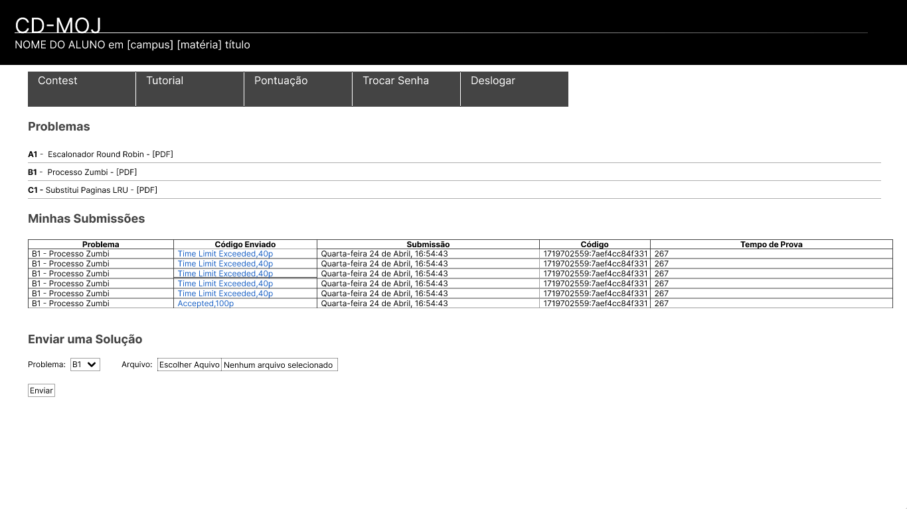{width: 250px}

<b>Fonte:</b> [Diego Sousa](https://github.com/DiegoSousaLeite) e [João Artur](https://github.com/joao-artl)

<b>Imagem 2</b> - Tela de Verificar Submissão

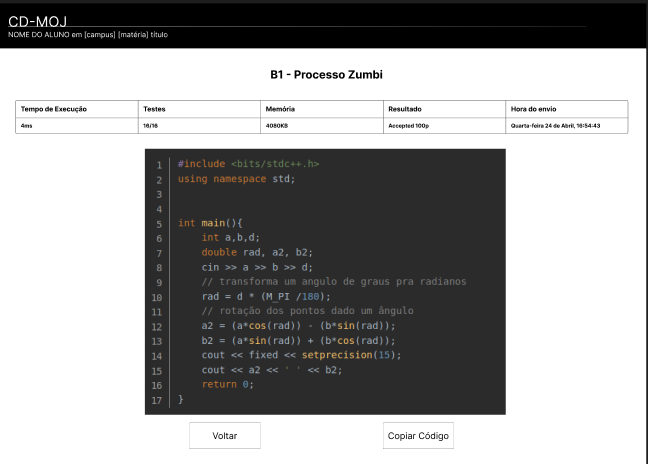{width: 250px}

<b>Fonte:</b> [João Artur](https://github.com/joao-artl)

<b>Imagem 3</b> - Tela de Ranking de Contest

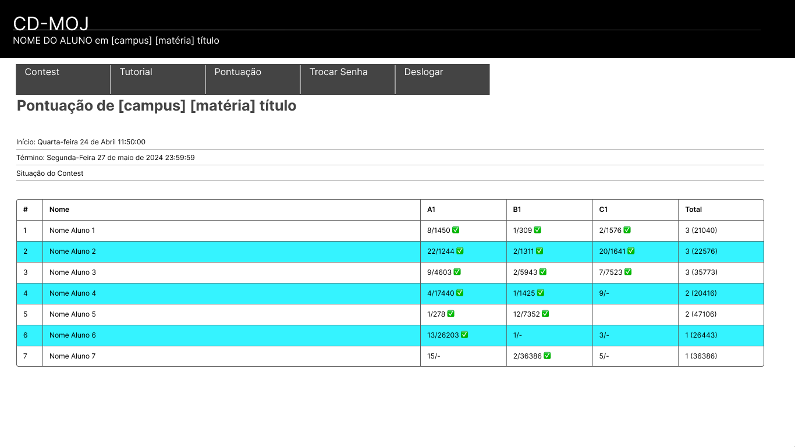{width: 250px}

<b>Fonte:</b>[Diego Sousa](https://github.com/DiegoSousaLeite)

### <a>Número e Perfil dos Usuários e Avaliadores</a>

Os participantes se encaixam no [perfil de usuário](https://interacao-humano-computador.github.io/2024.1-CD-MOJ/analise-de-requisitos/perfildeUsuario/), eles são usuários de entre 18 e 30 anos, estudante de ensino superior e usuários frequentes do CD-MOJ.

### <a>Sumário dos Dados Coletados</a>

Durante a entrevista foram coletados dados sobre, a interação do usuário com o sistema, feedbacks sobre o Protótipo de Alta Fidelidade e as respostas das perguntas presentes no [planejamento da avaliação](https://interacao-humano-computador.github.io/2024.1-CD-MOJ/design-avaliacao-desenvolvimento/nivel3/planejAvaliacao/), abaixo estão as respostas de cada participante:

??? note "Respostas Paulo Henrique"
    

    
<b>Tabela 3</b> - Respostas do Paulo Henrique para o Roteiro de Perguntas

    | **ID** | **Pergunta** | **Propósito** | **Resposta** |
    | --- | --- | --- | --- |
    | 1 | A prototipação representa bem o seu propósito? | Verificação de conformidade com a tarefa. | Sim |
    | 2 | O layout corresponde com as expectativas do usuário sobre como deveria ser a tela? | Verificação de aderência às expectativas do usuário. | Sim |
    | 3 | Os aspectos de usabilidade estão bem evidentes na prototipação? | Avaliação da clareza e facilidade de uso. | Sim |
    | 4 | A prototipação oferece dificuldades sobre visualização do conteúdo da tela? | Identificação de problemas de visibilidade e legibilidade. | Não |
    | 5 | Os elementos interativos estão claramente identificados? | Verificação da identificação clara de elementos clicáveis e interativos. | Sim |
    | 6 | O fluxo de navegação está intuitivo? | Avaliação da facilidade de navegação e sequência lógica das telas. | Sim |
    | 7 | O protótipo permite uma fácil compreensão das funcionalidades? | Verificação da clareza das funcionalidades apresentadas. | Sim |
    | 8 | Há algum elemento ou informação que esteja faltando? | Identificação de lacunas ou elementos ausentes. | Não o prototipo está completo pela experiência do entrevistado |
    | 9 | A estrutura da informação está organizada de forma lógica? | Avaliação da organização e hierarquia da informação. | Sim |
    | 10 | O protótipo permite a realização das tarefas principais de forma eficiente? | Verificação da eficiência na realização de tarefas principais. | Sim |
    | 11 | Existem barreiras que dificultam a execução de ações pelo usuário? | Identificação de barreiras ou dificuldades na interação. | Não |
    | 12 | A disposição dos elementos na tela facilita a execução das tarefas? | Avaliação da disposição e acessibilidade dos elementos. | Sim |
    | 13 | O protótipo proporciona uma experiência satisfatória para o usuário? | Avaliação geral da satisfação do usuário com o protótipo. | Sim |

    
<b>Fonte:</b> [João Artur](https://github.com/joao-artl) e [Diego Sousa](https://github.com/DiegoSousaLeite).

    

??? note "Respostas José Eduardo"
    

    
<b>Tabela 4</b> - Respostas do José Eduardo para o Roteiro de Perguntas

    | **ID** | **Pergunta** | **Propósito** | **Resposta** |
    | --- | --- | --- | --- |
    | 1 | A prototipação representa bem o seu propósito? | Verificação de conformidade com a tarefa. | Sim |
    | 2 | O layout corresponde com as expectativas do usuário sobre como deveria ser a tela? | Verificação de aderência às expectativas do usuário. | Sim |
    | 3 | Os aspectos de usabilidade estão bem evidentes na prototipação? | Avaliação da clareza e facilidade de uso. | Sim |
    | 4 | A prototipação oferece dificuldades sobre visualização do conteúdo da tela? | Identificação de problemas de visibilidade e legibilidade. | Não |
    | 5 | Os elementos interativos estão claramente identificados? | Verificação da identificação clara de elementos clicáveis e interativos. | Sim |
    | 6 | O fluxo de navegação está intuitivo? | Avaliação da facilidade de navegação e sequência lógica das telas. | Sim |
    | 7 | O protótipo permite uma fácil compreensão das funcionalidades? | Verificação da clareza das funcionalidades apresentadas. | Sim |
    | 8 | Há algum elemento ou informação que esteja faltando? | Identificação de lacunas ou elementos ausentes. | Não o prototipo está completo pela experiência do entrevistado |
    | 9 | A estrutura da informação está organizada de forma lógica? | Avaliação da organização e hierarquia da informação. | Sim |
    | 10 | O protótipo permite a realização das tarefas principais de forma eficiente? | Verificação da eficiência na realização de tarefas principais. | Sim |
    | 11 | Existem barreiras que dificultam a execução de ações pelo usuário? | Identificação de barreiras ou dificuldades na interação. | Não |
    | 12 | A disposição dos elementos na tela facilita a execução das tarefas? | Avaliação da disposição e acessibilidade dos elementos. | Sim |
    | 13 | O protótipo proporciona uma experiência satisfatória para o usuário? | Avaliação geral da satisfação do usuário com o protótipo. | Sim |

    
<b>Fonte:</b> [João Artur](https://github.com/joao-artl) e [Diego Sousa](https://github.com/DiegoSousaLeite).

    

### <a>Interpretação e Análise dos Dados</a>

A partir das entrevistas realizadas e da observação dos usuários, pode-se concluir que os Protótipos de Alta Fidelidade das tarefas de Verificar Submissões e Ranking de Contest estão em conformidade com a realidade e atendem às necessidades dos usuários do CD-MOJ.

### <a>Lista dos Problemas Encontrados</a>
Os usuários não identificaram problemas nos protótipos de Alta Fidelidade.

### <a>Planejamento para o Reprojeto do Sistema</a>
Como nenhum problema foi identificado não existe necessidade de realizar um reprojeto.

### <a>Gravação das Entevistas</a>

#### <a>Gravação da Entevista 1</a>

**Gravação da Entrevista com o Usuário Paulo realizada pelos membros [João Artur](https://github.com/joao-artl) e  [Diego Sousa](https://github.com/DiegoSousaLeite)**

<iframe width="560" height="315" src="https://www.youtube.com/embed/gMbETqAr_4w?si=OgqkEXjEuNv4VpsC" title="YouTube video player" frameborder="0" allow="accelerometer; autoplay; clipboard-write; encrypted-media; gyroscope; picture-in-picture; web-share" referrerpolicy="strict-origin-when-cross-origin" allowfullscreen></iframe>

#### <a>Gravação da Entevista 2</a>

**Gravação da Entrevista com o Usuário José realizada pelos membros [João Artur](https://github.com/joao-artl) e  [Diego Sousa](https://github.com/DiegoSousaLeite)**

<iframe width="560" height="315" src="https://www.youtube.com/embed/m8ylDYsjJDA?si=QR6dcu8Y_Q9ag3jU" title="YouTube video player" frameborder="0" allow="accelerometer; autoplay; clipboard-write; encrypted-media; gyroscope; picture-in-picture; web-share" referrerpolicy="strict-origin-when-cross-origin" allowfullscreen></iframe>

#### <a>Gravação da Entevista 3</a>

**Gravação da Entrevista com o Usuário xxxxxx**

## <a>Relato - Criação de Contest</a>

### <a>Objetivos e Escopo da Avaliação</a>

A avaliação teve como objetivo validar se o Protótipo de Alta Fidelidade Criação de Contest está de acordo com o fluxo de atividades do CD-MOJ e identificar áreas de melhoria para fornecer um suporte mais eficaz aos usuários.

### <a>Método de Avaliação Empregado</a>
O método de avaliação foi uma combinação de observação e entrevistas com o usuário, conforme o framework DECIDE<a id="anchor_2" href="#REF2">^2^</a>. Nela foi pedido que o usuário verificasse o fluxo apresentado pelo Protótipo de Alta Fidelidade e após isso ele foi perguntado sobre algumas questões. A tabela 3 apresenta as informações sobre as entrevistas e as imagens 4, 5 e 6 apresentam os Protótipos de Alta Fidelidade:

<b>Tabela 6</b> - Cronograma das Entrevistas

| Entrevistador(es) | Entrevistado(s) | Horário | Duração  | Data | Local |
| :----------------: | :-------------: | :---------------: | :------------: | :--------: | :----------: |
| [Douglas Marinho](https://github.com/M4RINH0)| Júlia Fortunato | 17:50 | 7 minutos | 03/07/2023 | Microsoft Teams |
| [Douglas Marinho](https://github.com/M4RINH0)| Ana Júlia | 19:00 | 8 minutos | 03/07/2023 | Casa do entrevistador |
| [Douglas Marinho](https://github.com/M4RINH0)| Felipe Motta | 22:00 | 8 minutos | 03/07/2023 | Microsoft Teams |

<b>Fonte:</b> [Douglas Marinho](https://github.com/M4RINH0)

<b>Imagem 4</b> - Tela com pop-up de Calendário

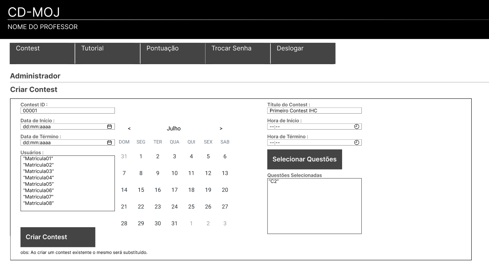{width: 250px}

<b>Fonte:</b> [Douglas Marinho](https://github.com/M4RINH0)

<b>Imagem 5</b> - Tela com pop-up de Relógio

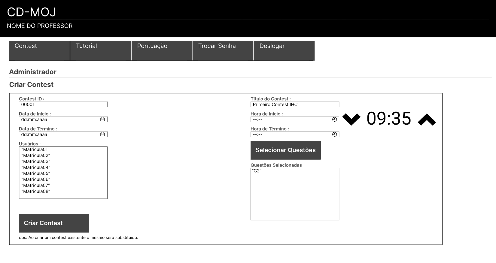{width: 250px}

<b>Fonte:</b> [Douglas Marinho](https://github.com/M4RINH0)

<b>Imagem 6</b> - Tela com pop-up de Seleção de Questão

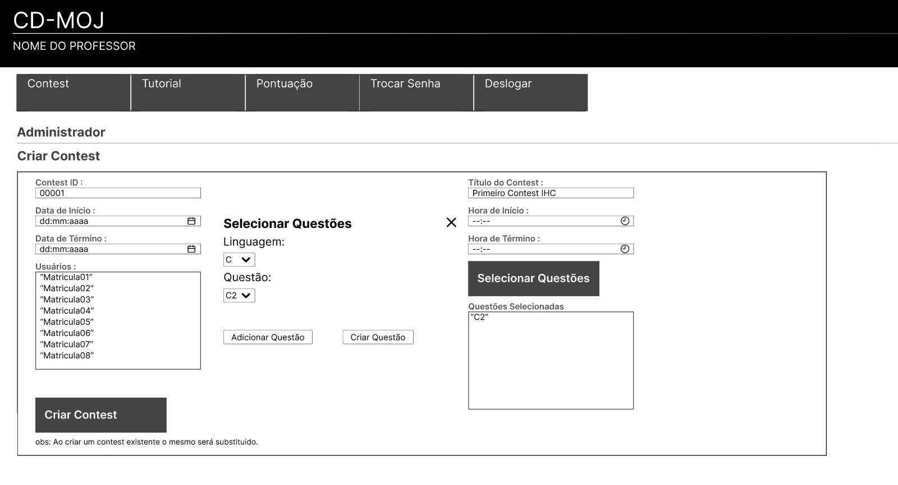{width: 250px}

<b>Fonte:</b>[Douglas Marinho](https://github.com/M4RINH0)

### <a>Número e Perfil dos Usuários e Avaliadores</a>

Os participantes se encaixam no [perfil de usuário](https://interacao-humano-computador.github.io/2024.1-CD-MOJ/analise-de-requisitos/perfildeUsuario/), eles são usuários de entre 18 e 30 anos, estudante de ensino superior e usuários frequentes do CD-MOJ.

### <a>Sumário dos Dados Coletados</a>

Durante a entrevista foram coletados dados sobre, a interação do usuário com o sistema, feedbacks sobre o Protótipo de Alta Fidelidade e as respostas das perguntas presentes no [planejamento da avaliação](https://interacao-humano-computador.github.io/2024.1-CD-MOJ/design-avaliacao-desenvolvimento/nivel3/planejAvaliacao/) e as respostas de cada entrevista a seguir:

??? note "Respostas Ana Júlia"
    

    
<b>Tabela 7</b> - Respostas da Ana Júlia para o Roteiro de Perguntas

    | **ID** | **Pergunta** | **Propósito** | **Resposta** |
    | --- | --- | --- | --- |
    | 1 | A prototipação representa bem o seu propósito? | Verificação de conformidade com a tarefa. | Sim |
    | 2 | O layout corresponde com as expectativas do usuário sobre como deveria ser a tela? | Verificação de aderência às expectativas do usuário. | Sim |
    | 3 | Os aspectos de usabilidade estão bem evidentes na prototipação? | Avaliação da clareza e facilidade de uso. | Sim |
    | 4 | A prototipação oferece dificuldades sobre visualização do conteúdo da tela? | Identificação de problemas de visibilidade e legibilidade. | Não |
    | 5 | Os elementos interativos estão claramente identificados? | Verificação da identificação clara de elementos clicáveis e interativos. | Sim |
    | 6 | O fluxo de navegação está intuitivo? | Avaliação da facilidade de navegação e sequência lógica das telas. | Sim |
    | 7 | O protótipo permite uma fácil compreensão das funcionalidades? | Verificação da clareza das funcionalidades apresentadas. | Sim |
    | 8 | Há algum elemento ou informação que esteja faltando? | Identificação de lacunas ou elementos ausentes. | Não o prototipo está completo pela experiência do entrevistado |
    | 9 | A estrutura da informação está organizada de forma lógica? | Avaliação da organização e hierarquia da informação. | Sim |
    | 10 | O protótipo permite a realização das tarefas principais de forma eficiente? | Verificação da eficiência na realização de tarefas principais. | Sim |
    | 11 | Existem barreiras que dificultam a execução de ações pelo usuário? | Identificação de barreiras ou dificuldades na interação. | Não |
    | 12 | A disposição dos elementos na tela facilita a execução das tarefas? | Avaliação da disposição e acessibilidade dos elementos. | Sim |
    | 13 | O protótipo proporciona uma experiência satisfatória para o usuário? | Avaliação geral da satisfação do usuário com o protótipo. | Sim |
    
<b>Fonte:</b> [Douglas Marinho](https://github.com/M4RINH0).

    

??? note "Respostas Júlia Fortunato"
    

    
<b>Tabela 8</b> - Respostas da Júlia Fortunato para o Roteiro de Perguntas

    | **ID** | **Pergunta** | **Propósito** | **Resposta** |
    | --- | --- | --- | --- |
    | 1 | A prototipação representa bem o seu propósito? | Verificação de conformidade com a tarefa. | Sim |
    | 2 | O layout corresponde com as expectativas do usuário sobre como deveria ser a tela? | Verificação de aderência às expectativas do usuário. | Sim |
    | 3 | Os aspectos de usabilidade estão bem evidentes na prototipação? | Avaliação da clareza e facilidade de uso. | Sim |
    | 4 | A prototipação oferece dificuldades sobre visualização do conteúdo da tela? | Identificação de problemas de visibilidade e legibilidade. | Não |
    | 5 | Os elementos interativos estão claramente identificados? | Verificação da identificação clara de elementos clicáveis e interativos. | Sim |
    | 6 | O fluxo de navegação está intuitivo? | Avaliação da facilidade de navegação e sequência lógica das telas. | Sim |
    | 7 | O protótipo permite uma fácil compreensão das funcionalidades? | Verificação da clareza das funcionalidades apresentadas. | Sim |
    | 8 | Há algum elemento ou informação que esteja faltando? | Identificação de lacunas ou elementos ausentes. | Não o prototipo está completo pela experiência do entrevistado |
    | 9 | A estrutura da informação está organizada de forma lógica? | Avaliação da organização e hierarquia da informação. | Sim |
    | 10 | O protótipo permite a realização das tarefas principais de forma eficiente? | Verificação da eficiência na realização de tarefas principais. | Sim |
    | 11 | Existem barreiras que dificultam a execução de ações pelo usuário? | Identificação de barreiras ou dificuldades na interação. | Não |
    | 12 | A disposição dos elementos na tela facilita a execução das tarefas? | Avaliação da disposição e acessibilidade dos elementos. | Sim |
    | 13 | O protótipo proporciona uma experiência satisfatória para o usuário? | Avaliação geral da satisfação do usuário com o protótipo. | Sim |
    
<b>Fonte:</b> [Douglas Marinho](https://github.com/M4RINH0).

    

??? note "Respostas Felipe Motta"
    

    
<b>Tabela 9</b> - Respostas da Felipe Motta para o Roteiro de Perguntas

    | **ID** | **Pergunta** | **Propósito** | **Resposta** |
    | --- | --- | --- | --- |
    | 1 | A prototipação representa bem o seu propósito? | Verificação de conformidade com a tarefa. | Sim |
    | 2 | O layout corresponde com as expectativas do usuário sobre como deveria ser a tela? | Verificação de aderência às expectativas do usuário. | Sim |
    | 3 | Os aspectos de usabilidade estão bem evidentes na prototipação? | Avaliação da clareza e facilidade de uso. | Sim |
    | 4 | A prototipação oferece dificuldades sobre visualização do conteúdo da tela? | Identificação de problemas de visibilidade e legibilidade. | Não |
    | 5 | Os elementos interativos estão claramente identificados? | Verificação da identificação clara de elementos clicáveis e interativos. | Sim |
    | 6 | O fluxo de navegação está intuitivo? | Avaliação da facilidade de navegação e sequência lógica das telas. | Sim |
    | 7 | O protótipo permite uma fácil compreensão das funcionalidades? | Verificação da clareza das funcionalidades apresentadas. | Sim |
    | 8 | Há algum elemento ou informação que esteja faltando? | Identificação de lacunas ou elementos ausentes. | Não o prototipo está completo pela experiência do entrevistado |
    | 9 | A estrutura da informação está organizada de forma lógica? | Avaliação da organização e hierarquia da informação. | Sim |
    | 10 | O protótipo permite a realização das tarefas principais de forma eficiente? | Verificação da eficiência na realização de tarefas principais. | Sim |
    | 11 | Existem barreiras que dificultam a execução de ações pelo usuário? | Identificação de barreiras ou dificuldades na interação. | Não |
    | 12 | A disposição dos elementos na tela facilita a execução das tarefas? | Avaliação da disposição e acessibilidade dos elementos. | Sim |
    | 13 | O protótipo proporciona uma experiência satisfatória para o usuário? | Avaliação geral da satisfação do usuário com o protótipo. | Sim |
    
<b>Fonte:</b> [Douglas Marinho](https://github.com/M4RINH0).

    

### <a>Interpretação e Análise dos Dados</a>

A partir das entrevistas realizadas e da observação dos usuários, pode-se concluir que o Protótipo de Alta Fidelidade da tarefa de Criação de Contest estão em conformidade com a realidade e atendem às necessidades dos usuários do CD-MOJ.

### <a>Lista dos Problemas Encontrados</a>
A entrevistada Júlia Fortunato afirmou que o botão que abre o calendário pode ser mais visivel para entender sua utilidade.

### <a>Planejamento para o Reprojeto do Sistema</a>

As mudanças sugeridas pelo usuário serão adicionadas ao Protótipo de Alta Fidelidade, a alteração será realizada pelo entrevistador conforme o cronograma presente na tabela 4 a seguir:

<figure markdown>
<b>Tabela 4</b> - Correção do Protótipo de Alta Fidelidade.

| Entrevistador | Data | Alteração |
| :----------------: | :-------------: | :---------------: | 
| [Douglas Marinho](https://github.com/M4RINH0)| - | - |

Fonte: [Douglas Marinho](https://github.com/M4RINH0).

### <a>Gravações das Entevistas</a>
<iframe width="560" height="315" src="https://www.youtube.com/embed/wxAtFnEurBQ?si=KziIj5_q0NSM4wdF" title="YouTube video player" frameborder="0" allow="accelerometer; autoplay; clipboard-write; encrypted-media; gyroscope; picture-in-picture; web-share" referrerpolicy="strict-origin-when-cross-origin" allowfullscreen></iframe>

<iframe width="560" height="315" src="https://www.youtube.com/embed/LAHrC_8nmKU?si=pG2t8SGSKTrcfPCv" title="YouTube video player" frameborder="0" allow="accelerometer; autoplay; clipboard-write; encrypted-media; gyroscope; picture-in-picture; web-share" referrerpolicy="strict-origin-when-cross-origin" allowfullscreen></iframe>

<iframe width="560" height="315" src="https://www.youtube.com/embed/6aEMtyDg5G0?si=K-xOHARuNeONdRi6" title="YouTube video player" frameborder="0" allow="accelerometer; autoplay; clipboard-write; encrypted-media; gyroscope; picture-in-picture; web-share" referrerpolicy="strict-origin-when-cross-origin" allowfullscreen></iframe>

## <a>Relato - Tutorial de Resolução de Questões Pós-Contest</a>

### <a>Objetivos e Escopo da Avaliação</a>

A avaliação teve como objetivo validar se o Protótipo de Alta Fidelidade da funcionalidade "Tutorial de Resolução de Questões Pós-Contest" está de acordo com o fluxo de atividades do CD-MOJ e identificar áreas de melhoria para fornecer um suporte mais eficaz aos usuários.

### <a>Método de Avaliação Empregado</a>
O método de avaliação foi uma combinação de observação e entrevistas com o usuário, conforme o framework DECIDE<a id="anchor_2" href="#REF2">^2^</a>. Nela foi pedido que o usuário verificasse o fluxo apresentado pelo Protótipo de Alta Fidelidade e após isso ele foi perguntado sobre algumas questões. A tabela 6 apresenta as informações sobre a entrevista e as imagens 7, 8 e 9 apresentam os Protótipos de Alta Fidelidade:

<b>Tabela 6</b> - Cronograma das Entrevistas

| Entrevistador(es) | Entrevistado(s) | Horário | Duração  | Data | Local |
| :----------------: | :-------------: | :---------------: | :------------: | :--------: | :----------: |
| [Arthur Alves](https://github.com/arthrok)| Gustavo | 13:50 | 5 minutos | 03/07/2023 | ITRAC - LDTEA (FGA) |
| [Arthur Alves](https://github.com/arthrok)| Luan | 14:00 | 5 minutos | 03/07/2023 | ITRAC - LDTEA (FGA) |
| [Arthur Alves](https://github.com/arthrok)| Joyce | 17:40 | 5 minutos | 03/07/2023 | Lappis Contâiner (FGA) |

<b>Fonte:</b> [Arthur Alves](https://github.com/arthrok)

<b>Imagem 7</b> - Tela Inicial do Contest

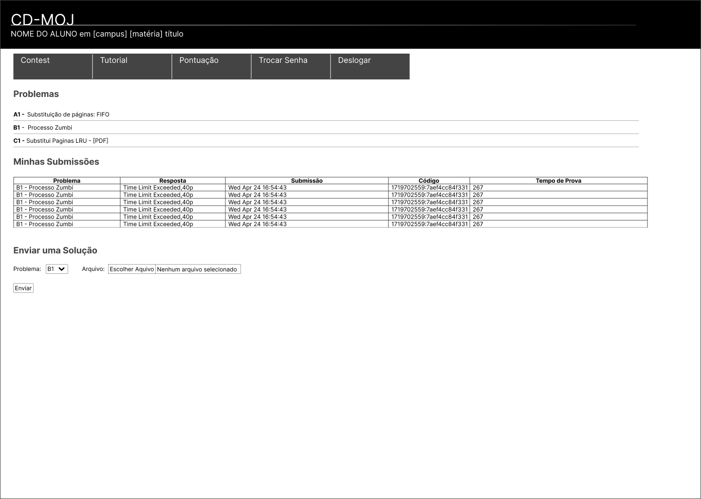{width: 250px}

<b>Fonte:</b>[Arthur Alves](https://github.com/arthrok)

<b>Imagem 8</b> - Tela com PopUp de Tutorial

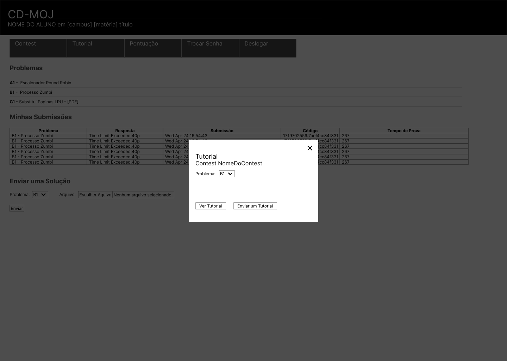{width: 250px}

<b>Fonte:</b>[Arthur Alves](https://github.com/arthrok)

<b>Imagem 9</b> - Tela de Tutorial da Questão Selecionada

{width: 250px}

<b>Fonte:</b>[Arthur Alves](https://github.com/arthrok)

### <a>Número e Perfil dos Usuários e Avaliadores</a>

Os participantes se encaixam no [perfil de usuário](https://interacao-humano-computador.github.io/2024.1-CD-MOJ/analise-de-requisitos/perfildeUsuario/), eles são usuários de entre 18 e 30 anos, estudante de ensino superior e usuários frequentes do CD-MOJ.

### <a>Sumário dos Dados Coletados</a>

Durante a entrevista foram coletados dados sobre, a interação do usuário com o sistema, feedbacks sobre o Protótipo de Alta Fidelidade e as respostas das perguntas presentes no [planejamento da avaliação](https://interacao-humano-computador.github.io/2024.1-CD-MOJ/design-avaliacao-desenvolvimento/nivel3/planejAvaliacao/). A seguir, as tabelas 11, 12 e 13 mostram as respostas dos entrevistados para o roteiro de perguntas.

??? "Respostas Gustavo"
    

    
<b>Tabela 11</b> - Respostas Gustavo para o Roteiro de Perguntas

    |**ID**|**Pergunta**|**Propósito**|**Resposta**|
    |---|---|---|---|
    |1|A prototipação representa bem o seu propósito?|Verificação de conformidade com a tarefa.|[X] Sim [ ] Não|
    |2|O layout corresponde com as expectativas do usuário sobre como deveria ser a tela?|Verificação de aderência às expectativas do usuário.|[X] Sim [ ] Não|
    |3|Os aspectos de usabilidade estão bem evidentes na prototipação?|Avaliação da clareza e facilidade de uso.|[X] Sim [ ] Não|
    |4|A prototipação oferece dificuldades sobre visualização do conteúdo da tela?|Identificação de problemas de visibilidade e legibilidade.|[ ] Sim [X] Não|
    |5|Os elementos interativos estão claramente identificados?|Verificação da identificação clara de elementos clicáveis e interativos.|[X] Sim [ ] Não|
    |6|O fluxo de navegação está intuitivo?|Avaliação da facilidade de navegação e sequência lógica das telas.|[X] Sim [ ] Não|
    |7|O protótipo permite uma fácil compreensão das funcionalidades?|Verificação da clareza das funcionalidades apresentadas.|[X] Sim [ ] Não|
    |8|Há algum elemento ou informação que esteja faltando?|Identificação de lacunas ou elementos ausentes.|Resposta aberta|
    |9|A estrutura da informação está organizada de forma lógica?|Avaliação da organização e hierarquia da informação.|[X] Sim [ ] Não|
    |10|O protótipo permite a realização das tarefas principais de forma eficiente?|Verificação da eficiência na realização de tarefas principais.|[X] Sim [ ] Não|
    |11|Existem barreiras que dificultam a execução de ações pelo usuário?|Identificação de barreiras ou dificuldades na interação.|[ ] Sim [X] Não|
    |12|A disposição dos elementos na tela facilita a execução das tarefas?|Avaliação da disposição e acessibilidade dos elementos.|[X] Sim [ ] Não|
    |13|O protótipo proporciona uma experiência satisfatória para o usuário?|Avaliação geral da satisfação do usuário com o protótipo.|[X] Sim [ ] Não|
    
    
<b>Fonte:</b> [Arthur Alves](https://github.com/Arthrok).

    

??? "Respostas Luan"
    

    
<b>Tabela 12</b> - Respostas Luan para o Roteiro de Perguntas

    |**ID**|**Pergunta**|**Propósito**|**Resposta**|
    |---|---|---|---|
    |1|A prototipação representa bem o seu propósito?|Verificação de conformidade com a tarefa.|[X] Sim [ ] Não|
    |2|O layout corresponde com as expectativas do usuário sobre como deveria ser a tela?|Verificação de aderência às expectativas do usuário.|[X] Sim [ ] Não|
    |3|Os aspectos de usabilidade estão bem evidentes na prototipação?|Avaliação da clareza e facilidade de uso.|[X] Sim [ ] Não|
    |4|A prototipação oferece dificuldades sobre visualização do conteúdo da tela?|Identificação de problemas de visibilidade e legibilidade.|[ ] Sim [X] Não|
    |5|Os elementos interativos estão claramente identificados?|Verificação da identificação clara de elementos clicáveis e interativos.|[X] Sim [ ] Não|
    |6|O fluxo de navegação está intuitivo?|Avaliação da facilidade de navegação e sequência lógica das telas.|[X] Sim [ ] Não|
    |7|O protótipo permite uma fácil compreensão das funcionalidades?|Verificação da clareza das funcionalidades apresentadas.|[X] Sim [ ] Não|
    |8|Há algum elemento ou informação que esteja faltando?|Identificação de lacunas ou elementos ausentes.|Resposta aberta|
    |9|A estrutura da informação está organizada de forma lógica?|Avaliação da organização e hierarquia da informação.|[X] Sim [ ] Não|
    |10|O protótipo permite a realização das tarefas principais de forma eficiente?|Verificação da eficiência na realização de tarefas principais.|[X] Sim [ ] Não|
    |11|Existem barreiras que dificultam a execução de ações pelo usuário?|Identificação de barreiras ou dificuldades na interação.|[ ] Sim [X] Não|
    |12|A disposição dos elementos na tela facilita a execução das tarefas?|Avaliação da disposição e acessibilidade dos elementos.|[X] Sim [ ] Não|
    |13|O protótipo proporciona uma experiência satisfatória para o usuário?|Avaliação geral da satisfação do usuário com o protótipo.|[X] Sim [ ] Não|
    
    
<b>Fonte:</b> [Arthur Alves](https://github.com/Arthrok).

    

??? "Respostas Joyce"
    

    
<b>Tabela 13</b> - Respostas Joyce para o Roteiro de Perguntas

    |**ID**|**Pergunta**|**Propósito**|**Resposta**|
    |---|---|---|---|
    |1|A prototipação representa bem o seu propósito?|Verificação de conformidade com a tarefa.|[X] Sim [ ] Não|
    |2|O layout corresponde com as expectativas do usuário sobre como deveria ser a tela?|Verificação de aderência às expectativas do usuário.|[X] Sim [ ] Não|
    |3|Os aspectos de usabilidade estão bem evidentes na prototipação?|Avaliação da clareza e facilidade de uso.|[X] Sim [ ] Não|
    |4|A prototipação oferece dificuldades sobre visualização do conteúdo da tela?|Identificação de problemas de visibilidade e legibilidade.|[ ] Sim [X] Não|
    |5|Os elementos interativos estão claramente identificados?|Verificação da identificação clara de elementos clicáveis e interativos.|[X] Sim [ ] Não|
    |6|O fluxo de navegação está intuitivo?|Avaliação da facilidade de navegação e sequência lógica das telas.|[X] Sim [ ] Não|
    |7|O protótipo permite uma fácil compreensão das funcionalidades?|Verificação da clareza das funcionalidades apresentadas.|[X] Sim [ ] Não|
    |8|Há algum elemento ou informação que esteja faltando?|Identificação de lacunas ou elementos ausentes.|Resposta aberta|
    |9|A estrutura da informação está organizada de forma lógica?|Avaliação da organização e hierarquia da informação.|[X] Sim [ ] Não|
    |10|O protótipo permite a realização das tarefas principais de forma eficiente?|Verificação da eficiência na realização de tarefas principais.|[X] Sim [ ] Não|
    |11|Existem barreiras que dificultam a execução de ações pelo usuário?|Identificação de barreiras ou dificuldades na interação.|[ ] Sim [X] Não|
    |12|A disposição dos elementos na tela facilita a execução das tarefas?|Avaliação da disposição e acessibilidade dos elementos.|[X] Sim [ ] Não|
    |13|O protótipo proporciona uma experiência satisfatória para o usuário?|Avaliação geral da satisfação do usuário com o protótipo.|[X] Sim [ ] Não|
    
    
<b>Fonte:</b> [Arthur Alves](https://github.com/Arthrok).

    

### <a>Interpretação e Análise dos Dados</a>

A partir das entrevistas realizadas e da observação dos usuários, pode-se concluir que os Protótipos de Alta Fidelidade da funcionalidade de Tutorial de Resolução de Questões Pós-Contest está em conformidade com o padrão do que os usuários esperam, uma vez que é uma funcionalidade não existente na plataforma, e atendem às necessidades dos usuários do CD-MOJ.

### <a>Lista dos Problemas Encontrados</a>
Não foi relatado nenhum problema no protótipo.

### <a>Planejamento para o Reprojeto do Sistema</a>

Como não foram identificados problemas, não há necessidade de realizar um reprojeto no momento.

### <a>Gravação da Entevista</a>

<iframe width="560" height="315" src="https://www.youtube.com/embed/KcEgL4d_KWw" title="Validação Protótipo de Alta Fidelidade Tutorial de Resolução de Questões Pós Contest  - Gustavo" frameborder="0" allow="accelerometer; autoplay; clipboard-write; encrypted-media; gyroscope; picture-in-picture; web-share" referrerpolicy="strict-origin-when-cross-origin" allowfullscreen></iframe>

<iframe width="560" height="315" src="https://www.youtube.com/embed/_k8yBeJZiG4" title="Validação Protótipo de Alta Fidelidade Tutorial de Resolução de Questões Pós Contest - Luan" frameborder="0" allow="accelerometer; autoplay; clipboard-write; encrypted-media; gyroscope; picture-in-picture; web-share" referrerpolicy="strict-origin-when-cross-origin" allowfullscreen></iframe>

<iframe width="560" height="315" src="https://www.youtube.com/embed/egzJdfEMSCA" title="Validação Protótipo de Alta Fidelidade Tutorial de Resolução de Questões Pós Contest - Joyce" frameborder="0" allow="accelerometer; autoplay; clipboard-write; encrypted-media; gyroscope; picture-in-picture; web-share" referrerpolicy="strict-origin-when-cross-origin" allowfullscreen></iframe>

## <a>Relato - Submissão de Problemas</a>

### <a>Objetivos e Escopo da Avaliação</a>

A avaliação teve como objetivo validar se o Protótipo de Alta Fidelidade da funcionalidade "Submissão de Problemas" está de acordo com o fluxo de atividades do CD-MOJ e identificar áreas de melhoria para fornecer um suporte mais eficaz aos usuários.

### <a>Método de Avaliação Empregado</a>
O método de avaliação foi uma combinação de observação e entrevistas com o usuário, conforme o framework DECIDE<a id="anchor_2" href="#REF2">^2^</a>. Nela foi pedido que o usuário verificasse o fluxo apresentado pelo Protótipo de Alta Fidelidade e após isso ele foi perguntado sobre algumas questões. A tabela 7 apresenta as informações sobre a entrevista e as figuras 10, 11 e 12 apresentam os Protótipos de Alta Fidelidade:

<b>Tabela 7</b> - Cronograma das Entrevistas

| Entrevistador(es) | Entrevistado(s) | Horário | Duração  | Data | Local |
| :----------------: | :-------------: | :---------------: | :------------: | :--------: | :----------: |
| [Eric Silveira](https://github.com/ericbky)     | Luan     |<a href="/2024.1-CD-MOJ/design-avaliacao-desenvolvimento/nivel1/storyboard/storyboards/#tarefa-1-submissao-de-problemas">Submissão de Problemas</a>            | 14:30         | 03/07     | ITRAC - LDTEA (FGA)  |
| [Eric Silveira](https://github.com/ericbky)     | Joyce    |<a href="/2024.1-CD-MOJ/design-avaliacao-desenvolvimento/nivel1/storyboard/storyboards/#tarefa-1-submissao-de-problemas">Submissão de Problemas</a>            |    17:00   | 03/07      | Lappis Contâiner (FGA)|
| [Eric Silveira](https://github.com/ericbky)     | Gustavo    |<a href="/2024.1-CD-MOJ/design-avaliacao-desenvolvimento/nivel1/storyboard/storyboards/#tarefa-1-submissao-de-problemas">Submissão de Problemas</a>            | 17:42         | 03/07      | Lappis Contâiner (FGA) |Lappis Contâiner (FGA)   |

<b>Fonte:</b> [Eric Silveira](https://github.com/ericbky)

### <a>Imagens do Protótipo</a>

A seguir, as figuras de 08 até 13 ilustram a prototipação da tarefa designada que foi avaliada pelos usuários.

<b>Figura 10</b> - Problemas do Contest

{width: 250px}

<b>Fonte:</b> [Eric Silveira](https://github.com/ericbky)

<b>Figura 11</b> - Selecionando Questões nas alternativas

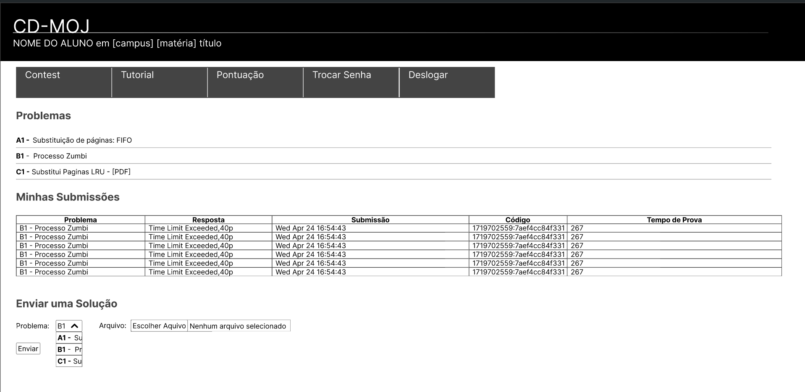{width: 250px}

<b>Fonte:</b> [Eric Silveira](https://github.com/ericbky)

<b>Figura 12</b> - Gerenciador de arquivos

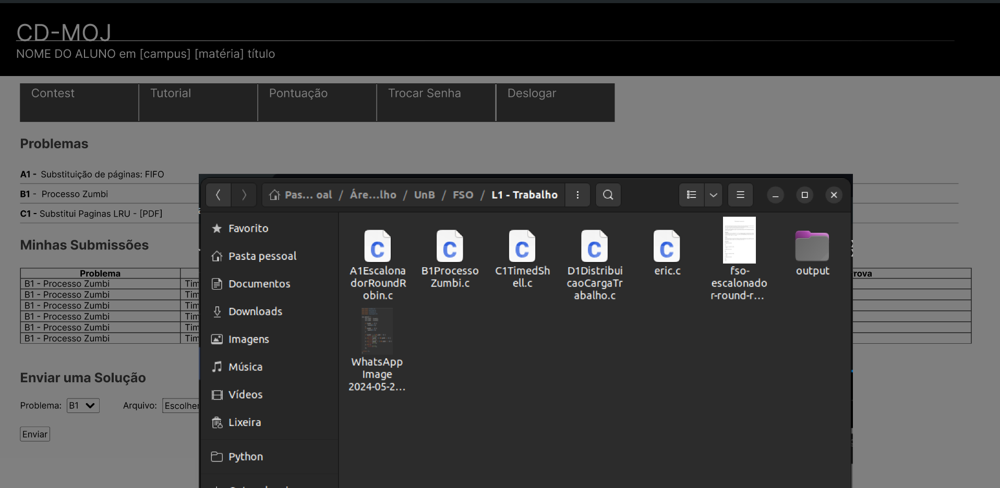{width: 250px}

<b>Fonte:</b> [Eric Silveira](https://github.com/ericbky)

<b>Figura 13</b> - Questão selecionada

{width: 250px}

<b>Fonte:</b> [Eric Silveira](https://github.com/ericbky)

<b>Figura 14</b> - Submissão enviada

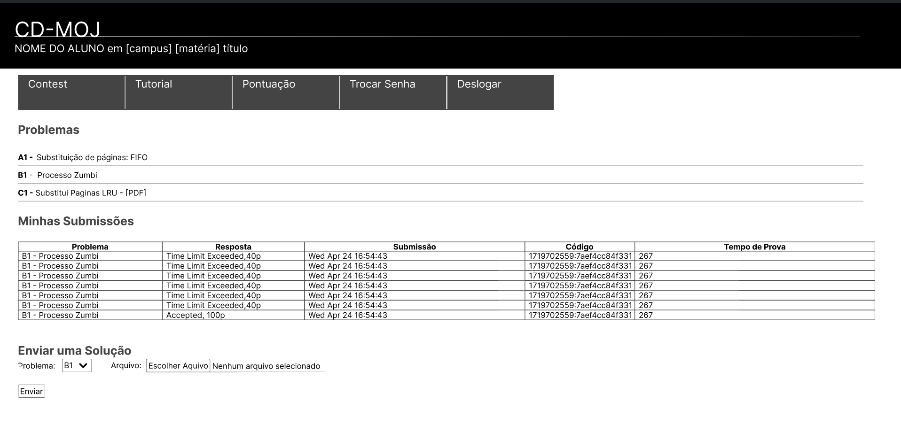{width: 250px}

<b>Fonte:</b> [Eric Silveira](https://github.com/ericbky)

### <a>Número e Perfil dos Usuários e Avaliadores</a>

Os participantes se encaixam no [perfil de usuário](https://interacao-humano-computador.github.io/2024.1-CD-MOJ/analise-de-requisitos/perfildeUsuario/), eles são usuários de entre 18 e 30 anos, estudante de ensino superior e usuários frequentes do CD-MOJ.

### <a>Sumário dos Dados Coletados</a>

Durante a entrevista foram coletados dados sobre, a interação do usuário com o sistema, feedbacks sobre o Protótipo de Alta Fidelidade e as respostas das perguntas presentes no [planejamento da avaliação](https://interacao-humano-computador.github.io/2024.1-CD-MOJ/design-avaliacao-desenvolvimento/nivel3/planejAvaliacao/).
De forma geral, os entrevistados relataram satisfação com a tarefa prototipada, ressaltaram ainda que não há necessidade de mudanças e que a funcionalidade já é eficiente por si só. Gostaram também do layout e afirmaram que realmente, o CD-MOJ tem um aparência não tão detalhada pois seu foco principal é na performance e voltado para os seus requisitos, de forma simples e objetiva.

??? "Respostas Luan"
    

    
<b>Tabela N</b> - Respostas Luan para o Roteiro de Perguntas

    |**ID**|**Pergunta**|**Propósito**|**Resposta**|
    |---|---|---|---|
    |1|A prototipação representa bem o seu propósito?|Verificação de conformidade com a tarefa.|[X] Sim [ ] Não|
    |2|O layout corresponde com as expectativas do usuário sobre como deveria ser a tela?|Verificação de aderência às expectativas do usuário.|[X] Sim [ ] Não|
    |3|Os aspectos de usabilidade estão bem evidentes na prototipação?|Avaliação da clareza e facilidade de uso.|[X] Sim [ ] Não|
    |4|A prototipação oferece dificuldades sobre visualização do conteúdo da tela?|Identificação de problemas de visibilidade e legibilidade.|[ ] Sim [X] Não|
    |5|Os elementos interativos estão claramente identificados?|Verificação da identificação clara de elementos clicáveis e interativos.|[X] Sim [ ] Não|
    |6|O fluxo de navegação está intuitivo?|Avaliação da facilidade de navegação e sequência lógica das telas.|[X] Sim [ ] Não|
    |7|O protótipo permite uma fácil compreensão das funcionalidades?|Verificação da clareza das funcionalidades apresentadas.|[X] Sim [ ] Não|
    |8|Há algum elemento ou informação que esteja faltando?|Identificação de lacunas ou elementos ausentes.|Resposta aberta|
    |9|A estrutura da informação está organizada de forma lógica?|Avaliação da organização e hierarquia da informação.|[X] Sim [ ] Não|
    |10|O protótipo permite a realização das tarefas principais de forma eficiente?|Verificação da eficiência na realização de tarefas principais.|[X] Sim [ ] Não|
    |11|Existem barreiras que dificultam a execução de ações pelo usuário?|Identificação de barreiras ou dificuldades na interação.|[ ] Sim [X] Não|
    |12|A disposição dos elementos na tela facilita a execução das tarefas?|Avaliação da disposição e acessibilidade dos elementos.|[X] Sim [ ] Não|
    |13|O protótipo proporciona uma experiência satisfatória para o usuário?|Avaliação geral da satisfação do usuário com o protótipo.|[X] Sim [ ] Não|
    
    
<b>Fonte:</b> [Eric Silveira](https://github.com/ericbky).

    

??? "Respostas Joyce"
    

    
<b>Tabela N</b> - Respostas Joyce para o Roteiro de Perguntas

    |**ID**|**Pergunta**|**Propósito**|**Resposta**|
    |---|---|---|---|
    |1|A prototipação representa bem o seu propósito?|Verificação de conformidade com a tarefa.|[X] Sim [ ] Não|
    |2|O layout corresponde com as expectativas do usuário sobre como deveria ser a tela?|Verificação de aderência às expectativas do usuário.|[X] Sim [ ] Não|
    |3|Os aspectos de usabilidade estão bem evidentes na prototipação?|Avaliação da clareza e facilidade de uso.|[X] Sim [ ] Não|
    |4|A prototipação oferece dificuldades sobre visualização do conteúdo da tela?|Identificação de problemas de visibilidade e legibilidade.|[ ] Sim [X] Não|
    |5|Os elementos interativos estão claramente identificados?|Verificação da identificação clara de elementos clicáveis e interativos.|[X] Sim [ ] Não|
    |6|O fluxo de navegação está intuitivo?|Avaliação da facilidade de navegação e sequência lógica das telas.|[X] Sim [ ] Não|
    |7|O protótipo permite uma fácil compreensão das funcionalidades?|Verificação da clareza das funcionalidades apresentadas.|[X] Sim [ ] Não|
    |8|Há algum elemento ou informação que esteja faltando?|Identificação de lacunas ou elementos ausentes.|Resposta aberta|
    |9|A estrutura da informação está organizada de forma lógica?|Avaliação da organização e hierarquia da informação.|[X] Sim [ ] Não|
    |10|O protótipo permite a realização das tarefas principais de forma eficiente?|Verificação da eficiência na realização de tarefas principais.|[X] Sim [ ] Não|
    |11|Existem barreiras que dificultam a execução de ações pelo usuário?|Identificação de barreiras ou dificuldades na interação.|[ ] Sim [X] Não|
    |12|A disposição dos elementos na tela facilita a execução das tarefas?|Avaliação da disposição e acessibilidade dos elementos.|[X] Sim [ ] Não|
    |13|O protótipo proporciona uma experiência satisfatória para o usuário?|Avaliação geral da satisfação do usuário com o protótipo.|[X] Sim [ ] Não|
    
    
<b>Fonte:</b> [Eric Silveira](https://github.com/ericbky).

    

??? "Respostas Gustavo"
    

    
<b>Tabela N</b> - Respostas Gustavo para o Roteiro de Perguntas

    |**ID**|**Pergunta**|**Propósito**|**Resposta**|
    |---|---|---|---|
    |1|A prototipação representa bem o seu propósito?|Verificação de conformidade com a tarefa.|[X] Sim [ ] Não|
    |2|O layout corresponde com as expectativas do usuário sobre como deveria ser a tela?|Verificação de aderência às expectativas do usuário.|[X] Sim [ ] Não|
    |3|Os aspectos de usabilidade estão bem evidentes na prototipação?|Avaliação da clareza e facilidade de uso.|[X] Sim [ ] Não|
    |4|A prototipação oferece dificuldades sobre visualização do conteúdo da tela?|Identificação de problemas de visibilidade e legibilidade.|[ ] Sim [X] Não|
    |5|Os elementos interativos estão claramente identificados?|Verificação da identificação clara de elementos clicáveis e interativos.|[X] Sim [ ] Não|
    |6|O fluxo de navegação está intuitivo?|Avaliação da facilidade de navegação e sequência lógica das telas.|[X] Sim [ ] Não|
    |7|O protótipo permite uma fácil compreensão das funcionalidades?|Verificação da clareza das funcionalidades apresentadas.|[X] Sim [ ] Não|
    |8|Há algum elemento ou informação que esteja faltando?|Identificação de lacunas ou elementos ausentes.|Resposta aberta|
    |9|A estrutura da informação está organizada de forma lógica?|Avaliação da organização e hierarquia da informação.|[X] Sim [ ] Não|
    |10|O protótipo permite a realização das tarefas principais de forma eficiente?|Verificação da eficiência na realização de tarefas principais.|[X] Sim [ ] Não|
    |11|Existem barreiras que dificultam a execução de ações pelo usuário?|Identificação de barreiras ou dificuldades na interação.|[ ] Sim [X] Não|
    |12|A disposição dos elementos na tela facilita a execução das tarefas?|Avaliação da disposição e acessibilidade dos elementos.|[X] Sim [ ] Não|
    |13|O protótipo proporciona uma experiência satisfatória para o usuário?|Avaliação geral da satisfação do usuário com o protótipo.|[X] Sim [ ] Não|
    
    
<b>Fonte:</b> [Eric Silveira](https://github.com/ericbky).

    

### <a>Interpretação e Análise dos Dados</a>

A partir das entrevistas realizadas e da observação dos usuários, pode-se concluir que os Protótipos de Alta Fidelidade da funcionalidade de Submissão de Problemas está em conformidade com o padrão e que é uma funcionalidade bem eficiente que no CD-MOJ ela é bem simples e intuitíva.

### <a>Lista dos Problemas Encontrados</a>
Não foi relatado nenhum problema no protótipo, pelo contrário, ambos os usuários gostaram da prototipação, acharam eficiente e que atende de maneira objetivo o seu propósito.

### <a>Planejamento para o Reprojeto do Sistema</a>

Como não foram identificados problemas, não há necessidade de realizar um reprojeto nessa prototipação.

### <a>Gravação da Entevista</a>

#### <a>Primeira entrevista</a>

<iframe width="560" height="315" src="https://www.youtube.com/embed/vT8eS5Zoc40?si=PyUG9fTm1ROMt67Z" title="YouTube video player" frameborder="0" allow="accelerometer; autoplay; clipboard-write; encrypted-media; gyroscope; picture-in-picture; web-share" referrerpolicy="strict-origin-when-cross-origin" allowfullscreen></iframe>

#### <a>Segunda entrevista
</a>

<iframe width="560" height="315" src="https://www.youtube.com/embed/Y9MjRwzEr0E?si=ViA9bGm1mDhdq0O4" title="YouTube video player" frameborder="0" allow="accelerometer; autoplay; clipboard-write; encrypted-media; gyroscope; picture-in-picture; web-share" referrerpolicy="strict-origin-when-cross-origin" allowfullscreen></iframe>

#### <a>Terceira entrevista</a>

<iframe width="560" height="315" src="https://www.youtube.com/embed/v5fWmXYMpGA?si=BIdL8C4c3d44yEWh" title="YouTube video player" frameborder="0" allow="accelerometer; autoplay; clipboard-write; encrypted-media; gyroscope; picture-in-picture; web-share" referrerpolicy="strict-origin-when-cross-origin" allowfullscreen></iframe>

## <a>Referências Bibliográficas</a>

> <a id="FRM1" href="#anchor_1">1.</a> Santa Rosa, José Guilherme. Avaliação e projeto no Design de Interfaces, capítulo 9.4.1 Equipamentos para os testes de usabilidade, página 157. Ano: Capa comum - 1 janeiro 2010.

## <a>Referências</a>

> <a>1.</a> Sharp, H., Rogers, Y., & Preece, J. (2007). **Interaction Design: Beyond Human-Computer Interaction**. John Wiley & Sons.

> <a>2.</a> Krug, S. (2014). **Don't Make Me Think, Revisited: A Common Sense Approach to Web Usability**. New Riders.

> <a>3.</a> [Planejamento da Avaliação do Protótipo de Alta Fidelidade - Grupo 01](https://interacao-humano-computador.github.io/2024.1-CD-MOJ/design-avaliacao-desenvolvimento/nivel3/planejAvaliacao/).

## <a>Histórico de Versão</a>

| Versão| Data | Data Prevista de Revisão | Descrição  | Autor(es)  | Revisor(es) |
| ------- | ------ | ---- | ------- | -------- | -------- |
| `1.0` | 03/07/2024 | 03/07/2024 | Criação da Documentação e inserção da tabela e metodologias. | [Eric Silveira](https://github.com/ericbky) |[Arthur Alves](https://github.com/Arthrok) e [João Artur](https://github.com/joao-artl)|
| `1.1` |  03/07/2024 | 03/07/2024  | Relato do protótipo de Alta fidelidade de verificação de submissões e ranking de Contest| [João Artur](https://github.com/joao-artl) | [Eric Silveira](https://github.com/ericbky) |
| `1.2` |  03/07/2024 | 03/07/2024  | Relato do protótipo de Alta fidelidade de Criação de Contest| [Douglas Marinho](https://github.com/M4RINH0) | [Eric Silveira](https://github.com/ericbky) |
| `1.3` |  03/07/2024 | 03/07/2024  | Relato do protótipo de Alta fidelidade de Tutorial de Resolução de Questões Pós-Contest| [Arthur Alves](https://github.com/Arthrok) | [Eric Silveira](https://github.com/ericbky) |
| `1.4` |  03/07/2024 | 03/07/2024  | Relato do protótipo de Alta fidelidade de Submissão de Problemas| [Eric Silveira](https://github.com/ericbky) | [Arthur Alves](https://github.com/Arthrok)|