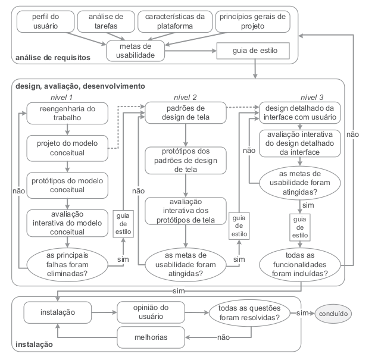

## <a>Introdução</a>

Mayhew (1999) propôs um ciclo de vida<a id="anchor_1" href="#REF1">1</a> para a engenharia de usabilidade que envolve três fases iterativas. A primeira fase, análise de requisitos, define metas de usabilidade com base no perfil dos usuários e na análise de tarefas, criando guias de estilos para verificar essas metas. Na segunda fase, design, avaliação e desenvolvimento, são criadas alternativas de solução e protótipos, que são refinados e avaliados em diferentes níveis de detalhe. A última fase, instalação, envolve a implementação do sistema final, assegurando que as metas de usabilidade estabelecidas sejam alcançadas.

## <a>Motivo de Escolha</a>

Após análise dos modelos, o grupo concluiu que o Ciclo de Vida de Mayhew<a id="anchor_1" href="#REF1">1</a> é o mais adequado para o projeto devido às suas etapas detalhadas e bem definidas, o que minimiza a subjetividade, presente nos outros Ciclos, e também acaba por auxiliar o grupo devido a inexperiência dos membros em IHC(Interação Humano-Computador). Como o sistema já está em produção, começamos [identificando problemas e melhorias existentes](https://interacao-humano-computador.github.io/2024.1-CD-MOJ/analise-de-requisitos/caracteristicasPlataforma/#requisitos-de-sistema). Em seguida, avançamos para a fase de [análise de requisitos](https://interacao-humano-computador.github.io/2024.1-CD-MOJ/analise-de-requisitos/analise-de-tarefas/analiseHierarquicaTarefa/), seguindo o fluxo previsto no modelo<a id="anchor_1" href="#REF1">1</a> e o [cronograma](https://interacao-humano-computador.github.io/2024.1-CD-MOJ/planejamento/cronograma/) elaborado pelo grupo.

## <a>Ciclo de Vida de Mayhew</a>

**A figura 1 mostra o ciclo de vida de Mayhew adotado pelo grupo durante o projeto:**

<figure markdown>

<b>Figura 1</b> - Atividades do Modelo de Ciclo de Vida de Mayhew.

{width: 300}
<figcaption>Fonte: BARBOSA e SILVA, 2021, p.119.</figcaption>
</figure>

## <a>Referência Bibliografica</a>

> <a id="REF1" href="#anchor_1">1.</a> Barbosa, S. D. J.; Silva, B. S. da; Silveira, M. S.; Gasparini, I.; Darin, T.; Barbosa, G. D. J. (2021) *Interação Humano-Computador e Experiência do usuário.* Capítulo 6. Processos de Design de IHC, tópico 6.3.3 Engenharia de Usabilidade de Mayhew, página 119. Autopublicação. ISBN: 978-65-00-19677-1.

## <a>Histórico de Versão</a>

| Versão| Data | Data Prevista de Revisão| Descrição  | Autor(es)  | Revisor(es) |
| ------- | ------ | ------ | ------- | -------- | -------- |
| `1.0` | 06/07/2024 | 06/07/2024 | Criando documento e adicionando ciclo de vida | [João Artur](https://github.com/joao-artl)|[Diego Sousa](https://github.com/DiegoSousaLeite) |